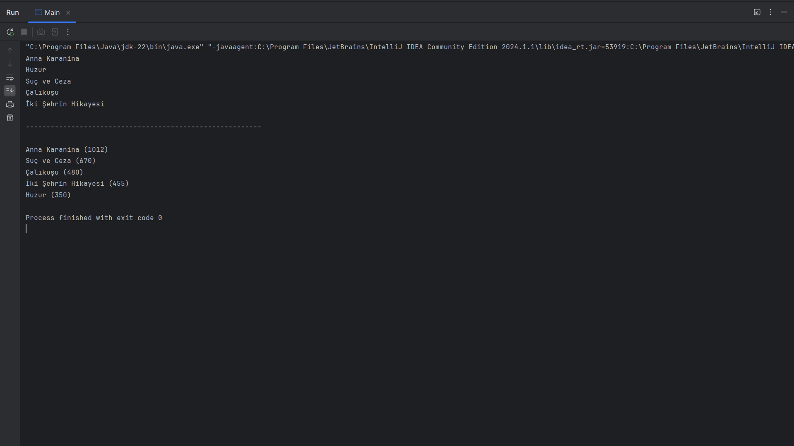
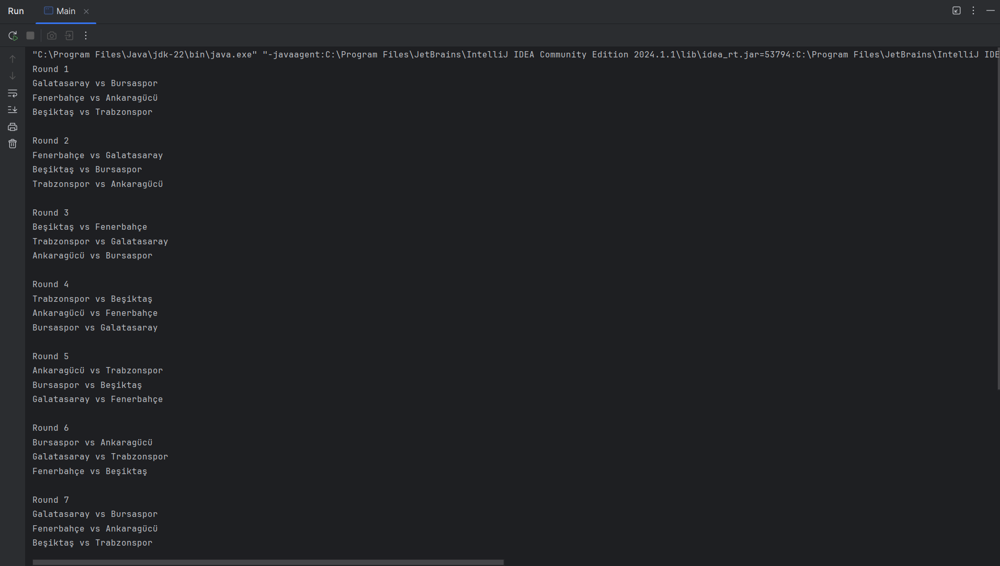

## Bölümlere göre pratikler ve ödevler:
* Collection ve Map Interface (Ödev: Kitap Sıralayıcı)
  
>Book isminde bir sınıf tasarlayınız. Bu sınıf Comparable interface'den kalıtım alıp "compareTo" metodunu override ediniz. Bu metodun içinde kitabı A'dan Z'ye isme >göre sıralayan kodu yazınız. Bu sınıftan 5 tane nesne oluşturun ve nesneleri Set tipinde bir yapısında saklayınız. Sonra ikinci kez Set tipinden bir veri yapısı >kullanın ve kitapları sayfa sayısına göre sıralamasını sağlayınız.
>Book sınıfı kitap ismi, sayfa sayısı, yazarın ismi, yayın tarihi değişkenlerinden oluşmaktadır.

* Collection ve Map Interface (Ödev: Fikstür Oluşturucu)
  
>Java ile girilen takımlar için rastgele maç fikstürü oluşturan bir sınıf yazılmalı.

>Kurallar :
>Çift Devreli Lig usülü uygulanacaktır. Her takım diğer takımlarla kendi evinde ve deplasmanda olmak üzere iki maç yapacaktır.
>Listenin sol tarafı ev sahibini sağ tarafı deplasman takımını gösterir.
>Eğer tek sayıda takım listesi girilirse, çift sayıya tamamlanacak şekilde "Bay" adında bir takım daha eklenmeli. Bay ile eşleşen takımlar o hafta maç yapmayacağı >anlamına gelir.

